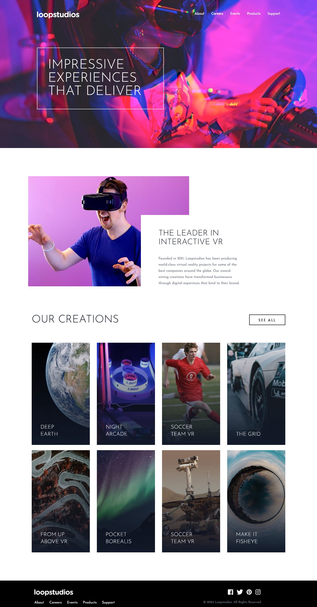

# Frontend Mentor - Loopstudios landing page solution

This is a solution to the [Loopstudios landing page challenge on Frontend Mentor](https://www.frontendmentor.io/challenges/loopstudios-landing-page-N88J5Onjw). Frontend Mentor challenges help you improve your coding skills by building realistic projects. 

### Screenshot

### Links

- Solution URL: [Solution](https://github.com/tugcekizildg/Loopstudios_Landing_Page_Challenge_frontendmentor.io)
- Live Site URL: [Live-Preview](https://66a131282f9a18008b5cc8ac--relaxed-vacherin-0d0223.netlify.app)

## My process

### Built with

- Semantic HTML5 markup
- Tailwind CSS
- Flexbox
- Mobile-first workflow

### What I learned
-I used TailwindCSS IntelliSense VSCode Extension to create easily and build.

-Transform and translate properties i used Mozilla DevTool also it helps me a lot give values Hamburger Menu button and image gradients animation.

-I used DevTools for give width to containers. Also i try to give exact margin and padding values to the sections.

## Author

- Website - [My GitHub](https://github.com/tugcekizildg)
- Frontend Mentor - [@tugcekizildg](https://www.frontendmentor.io/profile/tugcekizildg)
